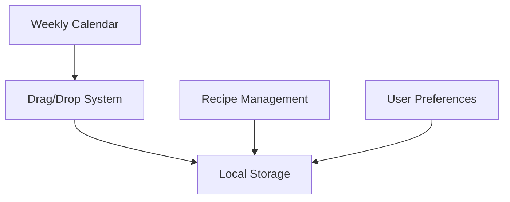

# Active Context

## Current Development Focus

### Primary Focus: Meal Planning Feature
The meal planning interface is the current priority, with several key components under development:

1. Weekly Calendar Grid
   - Status: Basic layout implemented
   - Next: Implement drag and drop functionality
   - Blocking Issues: None

2. Save/Load Functionality
   - Status: Pending implementation
   - Dependencies: Local storage integration
   - Priority: High

3. Drag and Drop Implementation
   - Status: Pending
   - Technical Approach: Evaluating options
   - Dependencies: Calendar grid completion

## Recent Changes

### Completed Features
1. Core Infrastructure
   - Project setup and configuration
   - Dependency installation
   - Basic routing implementation
   - API service integration

2. Recipe Management
   - Search functionality
   - Recipe card component
   - Local storage integration
   - Recipe saving system

3. UI/UX Implementation
   - Navigation component
   - Responsive design basics
   - Custom favicon
   - Browser caching

## Active Decisions

### 1. Technical Decisions
- Using React Query for API state management
- Implementing local storage for data persistence
- Leveraging MUI v6.4.6 for UI components
- TypeScript for type safety

### 2. Architecture Decisions

### 3. Implementation Decisions
- Atomic component design
- Type-safe storage patterns
- Context-based state management
- Progressive enhancement

## Current Challenges

### 1. Technical Challenges
- Implementing efficient drag and drop
- Managing complex state updates
- Optimizing performance
- Handling offline capabilities

### 2. UX Challenges
- Intuitive meal planning interface
- Responsive calendar design
- Touch device interactions
- Loading state management

## Next Steps

### Immediate Tasks
1. Complete weekly calendar grid
   - Implement drag and drop
   - Add meal slot management
   - Setup persistence

2. User Preferences
   - Theme selection
   - Calendar preferences
   - View customization

3. Testing Implementation
   - Component tests
   - Integration tests
   - Performance testing

### Upcoming Work
1. Error Boundaries
   - Component-level error handling
   - Fallback UI components
   - Error reporting system

2. Performance Optimization
   - Code splitting
   - Asset optimization
   - Caching strategy
   - Load time improvement

3. Documentation
   - API documentation
   - Component documentation
   - Setup instructions
   - Usage guidelines

## Active Considerations

### 1. Performance
- Monitoring load times
- Optimizing API calls
- Implementing proper caching
- Managing bundle size

### 2. User Experience
- Accessibility compliance
- Responsive design
- Error handling
- Loading states

### 3. Code Quality
- Testing coverage
- Type safety
- Code organization
- Documentation

## Risk Management

### Current Risks
1. Technical Risks
   - Complex state management
   - Performance optimization
   - Browser compatibility
   - API limitations

2. UX Risks
   - Calendar interface complexity
   - Mobile responsiveness
   - Offline functionality
   - Data persistence

### Mitigation Strategies
1. Technical
   - Comprehensive testing
   - Performance monitoring
   - Browser testing
   - Error handling

2. UX
   - User testing
   - Progressive enhancement
   - Fallback mechanisms
   - Clear error messages

## Success Metrics

### Current Focus
1. Development Velocity
   - Feature completion rate
   - Bug resolution time
   - Testing coverage

2. Technical Quality
   - Performance metrics
   - Error rates
   - Code quality scores

3. User Experience
   - Interface responsiveness
   - Feature accessibility
   - Error handling effectiveness
