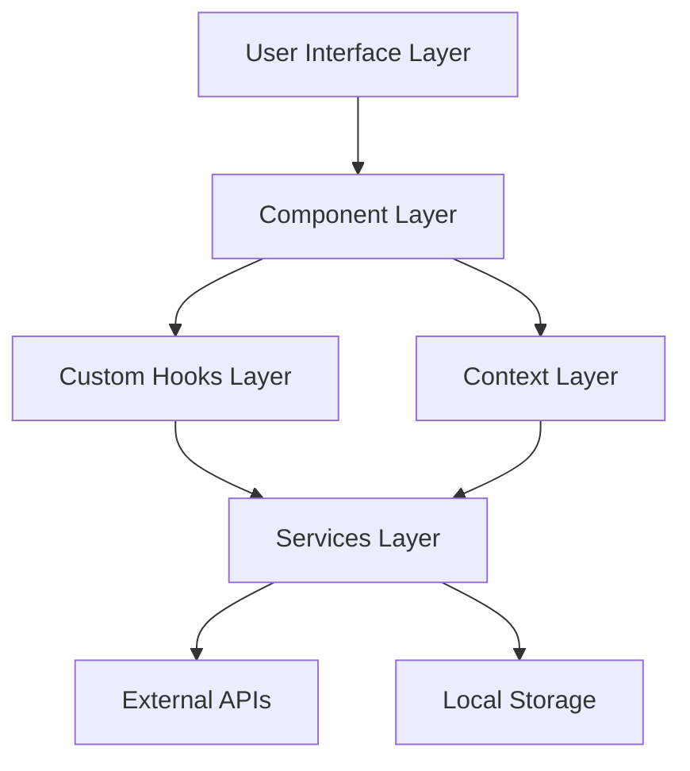
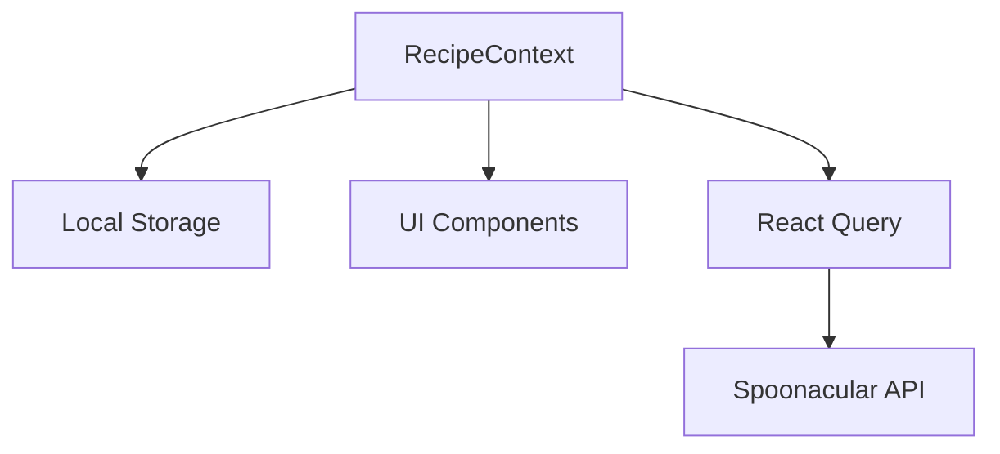
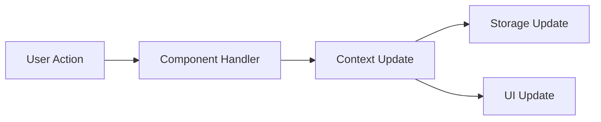

# System Patterns - Meal Planning Application

## Overview
This document builds upon the technical requirements defined in projectbrief.md, establishing the architectural patterns and technical decisions that shape the implementation. These patterns inform the active development tracked in activeContext.md.

## Architecture Overview
_Implementing the technical requirements from projectbrief.md:_



## Directory Structure
_Supporting the technical requirements and quality standards from projectbrief.md:_
```
src/
├── components/      # Reusable UI components
│   ├── Navigation  # App navigation
│   ├── RecipeCard # Recipe display
│   ├── SearchBar  # Search interface
│   └── skeletons/ # Loading states
├── pages/          # Route-level components
├── services/       # API and external services
├── hooks/          # Custom React hooks
├── context/        # React context providers
├── utils/          # Utility functions
├── types/          # TypeScript definitions
└── assets/         # Static assets
```

## Core Design Patterns
_These patterns implement the technical requirements while supporting the quality standards defined in projectbrief.md:_

### 1. Component Architecture
_Supporting responsive design and accessibility requirements:_
- Atomic Design Methodology
  - Atoms: Basic UI elements
  - Molecules: Simple component combinations
  - Organisms: Complex component combinations
  - Templates: Page layouts
  - Pages: Complete views

### 2. State Management
_Implementing the data management requirements:_


- Context-based state management
- Local storage persistence
- React Query for API state
- TypeScript for type safety

### 3. Data Flow Patterns
_Supporting efficient state management requirements:_


### 4. Component Patterns
_Implementing quality standards and user experience requirements:_
- Controlled components for forms
- Render props for complex logic
- Component composition
- Error boundaries
- Loading skeletons
- Lazy loading

### 5. Hook Patterns
_Supporting efficient state management and performance requirements:_
- Custom hooks for reusable logic
- Data fetching hooks
- State management hooks
- Effect cleanup
- Memoization

## Technical Implementation
_These implementations fulfill the technical requirements while adhering to the quality standards from projectbrief.md:_

### 1. API Integration
_Supporting recipe search functionality requirements:_
```typescript
// Pattern for API service methods
interface ApiMethod<T, R> {
  (params: T): Promise<R>;
}

// Implementation pattern
const apiMethod: ApiMethod<Params, Response> = async (params) => {
  try {
    const response = await api.get('/endpoint', { params });
    return response.data;
  } catch (error) {
    handleError(error);
    throw error;
  }
};
```

### 2. Storage Pattern
_Implementing local storage persistence requirements:_
```typescript
// Type-safe storage pattern
interface Storage<T> {
  get(key: string): T | null;
  set(key: string, value: T): void;
  remove(key: string): void;
}

// Implementation with error handling
const createStorage = <T>(): Storage<T> => ({
  get: (key) => {
    try {
      const item = localStorage.getItem(key);
      return item ? JSON.parse(item) : null;
    } catch (error) {
      console.error(`Storage error:`, error);
      return null;
    }
  },
  // ... other methods
});
```

### 3. Context Pattern
_Supporting efficient state management requirements:_
```typescript
// Context with reducer pattern
interface State<T> {
  data: T[];
  loading: boolean;
  error: Error | null;
}

type Action<T> =
  | { type: 'SET_DATA'; payload: T[] }
  | { type: 'SET_LOADING'; payload: boolean }
  | { type: 'SET_ERROR'; payload: Error };

const reducer = <T>(state: State<T>, action: Action<T>): State<T> => {
  switch (action.type) {
    // ... cases
  }
};
```

## Performance Patterns
_Implementing the performance optimization requirements from projectbrief.md:_

### 1. Loading States
_Supporting user experience requirements:_
- Skeleton screens for content loading
- Progressive image loading
- Lazy route loading
- Suspense boundaries

### 2. Caching Strategy
- Browser cache for static assets
- React Query cache for API data
- Local storage for user data
- Service worker for offline support

### 3. Optimization Techniques
- Component memoization
- Debounced search
- Virtual scrolling for lists
- Image optimization
- Code splitting

## Testing Patterns
_Implementing the comprehensive testing requirements from projectbrief.md:_

### 1. Component Testing
_Supporting quality standards:_
- Render testing
- User interaction testing
- Snapshot testing
- Integration testing

### 2. Hook Testing
- Custom hook testing
- State management testing
- Effect testing
- Error handling testing

### 3. Context Testing
- Provider testing
- Consumer testing
- Integration testing
- State updates testing

## Error Handling Patterns
_Supporting quality standards and user experience requirements:_

### 1. Error Boundaries
_Implementing error handling requirements:_
- Component-level error catching
- Fallback UI components
- Error reporting
- Recovery mechanisms

### 2. API Error Handling
- Error interceptors
- Retry mechanisms
- User feedback
- Graceful degradation

## Accessibility Patterns
_Implementing accessibility compliance requirements from projectbrief.md:_
- ARIA labels
- Keyboard navigation
- Focus management
- Color contrast
- Screen reader support
